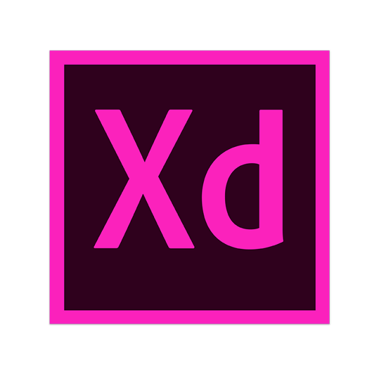

<h2 align="center">
Olá! Meu nome é Erick, tenho 21 anos e sou um estudande de Engenharia da Computação.
</h2>

<h2>Sobre mim:</h2>
<ul>
    <li>Cursando Engenharia da Computação 7/10 | GranTietê</li>
    <li>Formado no Curso Técnico de Desenvolvimente de Sistemas | ETEC</li>
    <li>Programador Full Stack | Gosto um pouco de tudo</li>
    <li>Hobbies: Animes, séries, livros e música</li>
</ul>

<h2>Cursos feitos:</h2>

Certificados obtidos em cursos online: [Clique aqui](https://github.com/ErickG123/ErickG123/tree/master/.github/certificates)

<h2>TCC do Curso Técnico:</h2>
- TCC feito com Arduino: [Clique aqui](https://github.com/ErickG123/projetoTCC)
    - Obs.: Para mais informações sobre o desenvolvimento do TCC, leia a README ou a documentação do mesmo.

<h1>Conhecimentos:</h1>

<h2>Front-end:</h2>
<table>
    <tr>
        <td align="center" width="96">
            
            HTML
        </td>
        <td align="center" width="96">
            
            CSS
        </td>
        <td align="center" width="96">
            
            SASS
        </td>
        <td align="center" width="96">
            
            JavaScript
        </td>
        <td align="center" width="96">
            
            jQuery
        </td>
        <td align="center" width="96">
            
            Node.js
        </td>
    </tr>
</table>

<h2>Back-end:</h2>
<table>
    <tr>
        <td align="center" width="96">
            
            C#
        </td>
        <td align="center" width="96">
            
            Ruby
        </td>
        <td align="center" width="96">
            
            Node.js
        </td>
    </tr>
</table>

<h2>Linguagem de maquina:</h2>
<table>
    <tr>
        <td align="center" width="96">
            
            Assembly
        </td>
    </tr>
</table>

<h2>Banco de dados:</h2>
<table>
    <tr>
        <td align="center" width="96">
            
            MySQL
        </td>
        <td align="center" width="96">
            
            SQL Server
        </td>
        <td align="center" width="96">
            
            PostgreSQL
        </td>
    </tr>
</table>

<h2>Frameworks:</h2>
<table>
    <tr>
        <td align="center" width="96">
            
            Ruby on Rails
        </td>
        <td align="center" width="96">
            
            Bootstrap
        </td>
        <td align="center" width="96">
            
            Ionic
        </td>
        <td align="center" width="96">
            
            ASP.NET
        </td>
        <td align="center" width="96">
            
            Tailwind CSS
        </td>
        <td align="center" width="96">
            
            Materialize CSS
        </td>
    </tr>
</table>

<h2>IDE's:</h2>
<table>
    <tr>
        <td align="center" width="96">
            
            Visual Studio
        </td>
        <td align="center" width="96">
            
            VSCode
        </td>
        <td align="center" width="96">
            
            PyCharm
        </td>
        <td align="center" width="96">
            
            Delphi
        </td>
    </tr>
</table>

<h2>Versionamento:</h2>
<table>
    <tr>
        <td align="center" width="96">
            
            Git
        </td>
        <td align="center" width="96">
            
            GitHub
        </td>
    </tr>
</table>

<h2>Gerenciadores de pacote:</h2>
<table>
    <tr>
        <td align="center" width="96">
            
            NPM
        </td>
        <td align="center" width="96">
            
            Yarn
        </td>
    </tr>
</table>

<h2>Outras ferramentas:</h2>
<table>
    <tr>
        <td align="center" width="96">
            
            Notion
        </td>
        <td align="center" width="96">
            
            Postman
        </td>
        <td align="center" width="96">
            
            Insomnia
        </td>
        <td align="center" width="96">
            
            Postbird
        </td>
    </tr>
</table>

<h2>Ferramentas da Adobe:</h2>
<table>
    <tr>
        <td align="center" width="96">
            
            Adobe Photoshop
        </td>
        <td align="center" width="96">
            
            Adobe XD
        </td>
    </tr>
</table>

<h2>Ferramentas da Microsoft:</h2>
<table>
    <tr>
        <td align="center" width="96">
            
            Microsoft Word
        </td>
        <td align="center" width="96">
            
            Microsoft Excel
        </td>
        <td align="center" width="96">
            
            Microsoft PowerPoint
        </td>
        <td align="center" width="96">
            
            Microsoft Visio
        </td>
        <td align="center" width="96">
            
            Microsoft OneDrive
        </td>
    </tr>
</table>

<h2>Comunicação:</h2>
<table>
    <tr>
        <td align="center" width="96">
            
            Slack
        </td>
        <td align="center" width="96">
            
            Google Meet
        </td>
        <td align="center" width="96">
            
            Zoom
        </td>
        <td align="center" width="96">
            
            Skype
        </td>
    </tr>
</table>

<h2>Sistemas operacionais:</h2>
<table>
    <tr>
        <td align="center" width="96">
            
            Windows
        </td>
        <td align="center" width="96">
            
            Linux
        </td>
    </tr>
</table>

<h2>Sistemas embarcados:</h2>
<table>
    <tr>
        <td align="center" width="96">
            
            Arduino
        </td>
        <td align="center" width="96">
            
            C++
        </td>
        <td align="center" width="96">
            
            Python
        </td>
    </tr>
</table>

<h2>Estatísticas:</h2>

